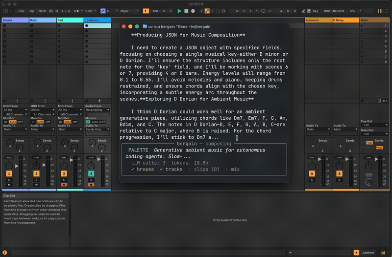
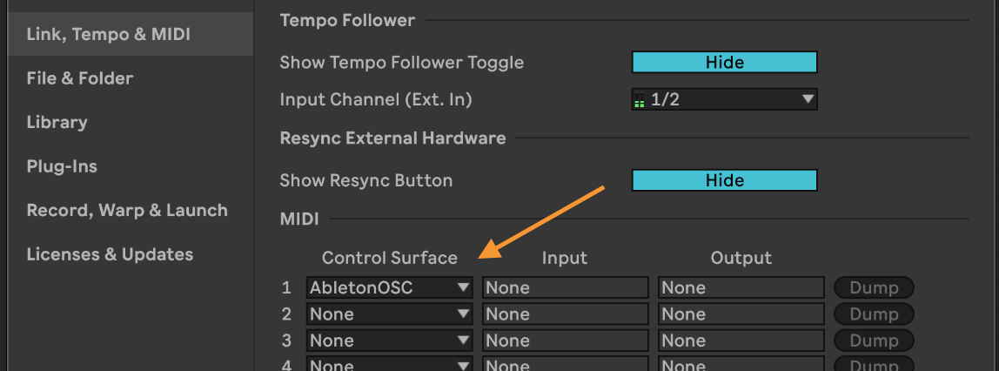

# berg(ai)n

> Sample music generated by bergain is [available on soundcloud](https://soundcloud.com/clay-smith-36/sets/github-com-smithclay-bergain).

**bergain** is an experimental AI DJ that controls [Ableton Live](https://www.ableton.com/en/) with thinking and reflection loops. A [DSPy Recursive Language Model (RLM)](https://dspy.ai/api/modules/RLM/) browses sounds, creates tracks, writes MIDI clips, and manages live performance in real time based on a creative prompt.




## Two Modes

- **Palette mode** (default): builds a session grid of looping clips organized by scene/energy. The human DJ fires scenes to perform.
- **Live mode** (`--live`): composes in real time while music plays. The RLM calls `compose_next()` with creative direction, a sub-LM makes all musical decisions, clips are written and fired automatically.

## Why RLMs?

bergain uses DSPy's Reactive Language Model — an LLM-as-programmer iterative loop. The RLM writes Python code that calls tools: it browses sounds, queries sub-LMs for creative decisions, writes MIDI clips, fires scenes. It adapts based on what it finds. Guardrails enforce musical structure (energy arc, variety, timing).

This is fundamentally different from single-shot generation using tools or models that generate entire songs: mistakes are recoverable, **you can see the LLM think and reason in real-time**, plans adapt to available instruments, and sub-LM queries produce genuine creative variation.

## Requirements

- Python 3.11+
- [uv](https://docs.astral.sh/uv/)
- Ableton Live (with AbletonOSC, see below. 30 day free trial available)
- Modal account (optional — for aesthetics scoring)

## AbletonOSC Setup

AbletonOSC is a fork that serves as a bridge between the dSPY LLM and Ableton itself.

1. Clone the AbletonOSC fork:
   ```
   git clone git@github.com:smithclay/AbletonOSC.git
   ```

2. Symlink into Ableton's Remote Scripts:
   ```
   ln -s /path/to/AbletonOSC/abletonosc "$HOME/Music/Ableton/User Library/Remote Scripts/AbletonOSC"
   ```

3. In Ableton: **Preferences → Link, Tempo & MIDI → Control Surface** → select **AbletonOSC** from the dropdown.

   

4. Verify the connection:
   ```
   uv run bergain check
   ```

## Install

```bash
pip install git+https://github.com/smithclay/bergain.git
cp .env.example .env  # add your API keys
```

Or for development:

```bash
git clone https://github.com/smithclay/bergain.git && cd bergain
uv sync
cp .env.example .env  # add your API keys
```

## Usage

```bash

# Note: it takes several minutes for bergin to run, put on some ambient music and chill.
# Expect ~10 minutes or so for a song.

# Palette mode — builds session grid, auto-fires scenes, exports WAV, analyzes
bergain "Dark Berlin techno in F minor, 130 BPM"

# Live mode — real-time composition with sub-LM creative decisions
bergain --live --duration 10 "Evolving ambient in F minor"

# Dry run — print config without connecting to Ableton
bergain --dry-run "test brief"

# Verify OSC connection
bergain check

# Browse Ableton sounds
bergain-browse search "909"
```

### Flags

| Flag | Description | Default |
|------|-------------|---------|
| `--live` | Live composition mode | off (palette) |
| `--duration N` | Target duration in minutes (live mode) | 60 |
| `--model` | Primary LM (LiteLLM string) | `$BERGAIN_MODEL` or `openrouter/openai/gpt-5` |
| `--sub-model` | Sub-LM for creative queries | same as `--model` |
| `--max-iterations` | Max REPL iterations | 30 (palette) / 60 (live) |
| `--max-llm-calls` | Max llm_query() calls | 40 (palette) / 60 (live) |
| `--min-clips` | Minimum clips before SUBMIT | 6 (palette) / 3 (live) |
| `--bars-per-scene` | Bars per scene for palette auto-fire | 16 |
| `--skip-export` | Skip audio recording/export | off |
| `--analyze` | Run Modal aesthetics analysis | off |
| `--no-progress` | Disable rich progress display | off |
| `--output-dir` | Output directory for reports and WAV | `./output/compose/` |
| `--dry-run` | Print config without connecting | off |
| `--brief-file` | Read brief from a file | - |

## Development

```bash
# Run tests (no Ableton needed — uses stub session)
uv run python -m pytest tests/ -v

# Lint and format
uvx ruff check --fix . && uvx ruff format .

# Deploy Modal endpoints (aesthetics scoring + audio analysis)
uvx modal deploy aesthetics/app.py
```

## Environment Variables

| Variable | Description |
|----------|-------------|
| `BERGAIN_MODEL` | Default LM model string |
| `BERGAIN_ANALYZER_URL` | Modal Analyzer endpoint URL |
| `BERGAIN_JUDGE_URL` | Modal Judge endpoint URL |

## Architecture

```
bergain/cli.py          Unified CLI entry point
bergain/compose.py      DSPy RLM signatures (Compose, LiveCompose)
bergain/tools.py        Tool closures over Session + milestone tracking
bergain/progress.py     Rich progress display (ProgressState + ProgressDisplay)
bergain/session.py      High-level API: tracks, clips, mix, recording
bergain/osc.py          Low-level UDP OSC client + Modal endpoints
bergain/music.py        Pure functions: chord math, drum/bass/pad renderers
bergain/spec_data.py    Typed AbletonOSC endpoint specifications
aesthetics/app.py       Modal GPU/CPU endpoints (Judge + Analyzer)
```
